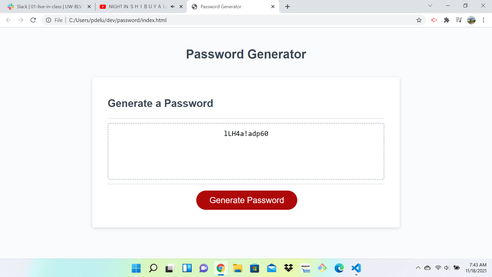

# password-generators 
 

1. what will my application need?
    list of all - numbers
                - Uppercase 
                - Lowercase
                - Special Characters

2. User to provied password length desired
  numbers
  lowercase
  uppercase
  numbers
  special characters. 

3. Declare variable to store values

4. create conditional statements and a for loop to created a password that meets the criteria
  a. make a list that only has the type of characters we are looing for.
  b. ask for criteria
  c.randomly select characters 
  d.add out characters to the password
  d.repeat until we reach our desired password length

link to page:
 
 https://deluus.github.io/password/

 link to repo:
 
 https://github.com/deluus/password